# Building an AI-Operated Homelab

### A practical, opinionated guide to a Proxmox homelab with an AI control plane — automation, a safety broker, self-hosted notifications, Obsidian docs, and GitHub, all wired to Claude and Claude Code

> **What this is.** A complete walkthrough of how to build a self-hosted "lab" where AI assistants help you *operate* the server safely — not just chat about it. It covers the hardware, the virtualization host, networking and remote access, push notifications, the automation broker that lets an AI request actions without ever getting a shell, the Git workflow that moves code around, and a Git-backed Obsidian documentation system.
>
> **What this is not.** A copy-paste install script. Your hardware, IP ranges, and domain will differ. Treat every IP, hostname, and path here as an *example* to translate into your own environment.

---

## How to read this guide

Each major section has two layers:

- The **technical detail** — what to build and roughly how.
- A **🟢 Plain English** box — the same idea explained as if to someone who has never run a server. If you're teaching others, the Plain English boxes are your script.

Throughout, the following are **placeholders** — substitute your own values:

| Placeholder | Means | Example you'd pick |
|---|---|---|
| `lab.example.com` | Your own domain | `home.smithfamily.net` |
| `rci27` | Your GitHub username | `jdoe` |
| `automation-repo` | Your automation Git repo | `my-homelab-automation` |
| `vault-repo` | Your Obsidian docs Git repo | `my-homelab-docs` |
| `192.168.1.x` | An address on your home network | whatever your router hands out |
| `100.x.x.x` | A Tailscale (private VPN) address | assigned automatically |
| `SERVER` | Your main server's hostname | pick anything — `vault`, `core`, `atlas` |

**Security note that runs through the whole guide:** secrets (passwords, API keys, private keys, exact notification topic names) are *never* written into Git, documentation, screenshots, or chat transcripts. They live in root-only files on the machine, and documentation only ever *points at the path* where the secret lives. This guide follows that rule everywhere, and you should too.

---

## Table of contents

1. [The big picture](#1-the-big-picture)
2. [Hardware and requirements](#2-hardware-and-requirements)
3. [The foundation: Proxmox and the container model](#3-the-foundation-proxmox-and-the-container-model)
4. [Networking and remote access](#4-networking-and-remote-access)
5. [Notifications: self-hosted ntfy](#5-notifications-self-hosted-ntfy)
6. [The automation brain: the broker and the three-way AI model](#6-the-automation-brain)
7. [GitHub and "Git-as-transport"](#7-github-and-git-as-transport)
8. [Documentation: a Git-backed Obsidian vault](#8-documentation-a-git-backed-obsidian-vault)
9. [Four worked examples](#9-four-worked-examples)
10. [The security model in one place](#10-the-security-model-in-one-place)
11. [Backups and recovery](#11-backups-and-recovery)
12. [Appendix: glossary and repo layout](#12-appendix)

---

## 1. The big picture

Before any commands, here's the shape of the whole thing. One physical server runs a hypervisor. On top of it sit many small, isolated "containers," each running one service. A few of those containers have special jobs: one handles all incoming traffic, one sends push notifications, and one is the **automation manager** that an AI can talk to through a tightly controlled gate.

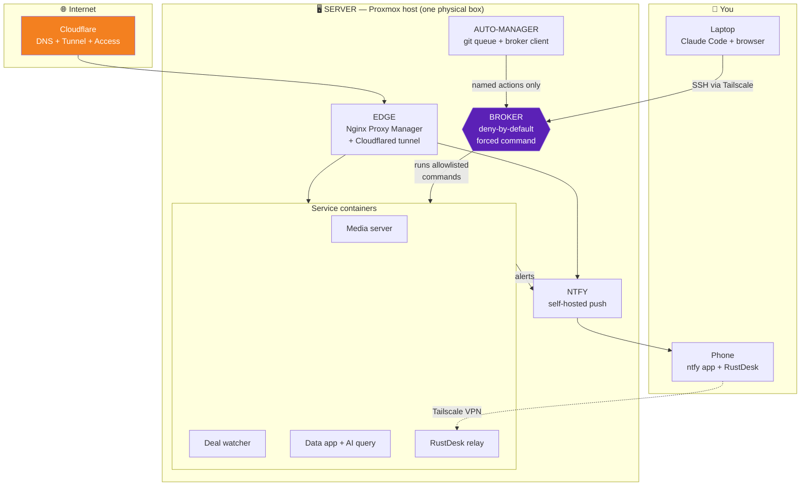

🟢 **Plain English.** Think of the server as an apartment building. Each apartment (container) holds one tenant (one app), so a fire in one apartment doesn't burn down the others. There's a front desk (EDGE) that decides who gets buzzed in from outside. There's an intercom system (ntfy) that texts your phone when something happens. And there's a building manager (the broker) who will do specific approved chores when asked — change a lightbulb, check the mail — but will *never* hand over the master keys to the whole building. The AI is like a very capable contractor who can ask the manager to do those approved chores, but can't roam the halls freely.

### The three planes

It helps to think of the system as three layers:

| Plane | What lives here | Who's in charge |
|---|---|---|
| **Data plane** | The actual services your family/you use (media, apps, dashboards) | runs on its own, mostly untouched |
| **Control plane** | The broker, the queue manager, ntfy approvals | tightly locked down; this is where AI acts |
| **Documentation plane** | The Obsidian vault + Git repos | records *why* things are the way they are |

Most homelab guides only cover the data plane. The value here is in the control and documentation planes — that's what makes it *operable* by an AI without becoming dangerous.

---

## 2. Hardware and requirements

You do **not** need matching hardware. The reference build for this guide was a small business desktop — a Lenovo ThinkCentre M70t Gen 3 (Intel Core i7-12700, 64 GB RAM), with a 1 TB NVMe boot drive, a second 1 TB NVMe in a PCIe adapter for fast app storage, and a 6 TB hard drive for bulk data and backups. It runs on a modest ~260 W power supply, which is the main thing that limits adding a power-hungry GPU later.

That machine is comfortable but generous. Here's how to think about what *you* need:

| Tier | Example hardware | Comfortably runs |
|---|---|---|
| **Minimum** | Any 4-core mini-PC, 16 GB RAM, 256 GB SSD | The control plane + a handful of light services |
| **Comfortable** | 6–8 core, 32 GB RAM, 1 TB NVMe + a bulk HDD | A dozen-plus services, a media server, some AI pipelines |
| **Generous** | 8+ cores, 64 GB RAM, dual NVMe + multi-TB HDD | Everything here plus headroom for local AI models |

The components that actually matter, in priority order: **RAM** (each container wants 0.5–4 GB; this is what you run out of first), then **a fast SSD/NVMe** for app data, then a **separate larger drive** for bulk media and backups, then **wired Ethernet** (Wi-Fi for a server is asking for trouble), and finally **cores** (an i5/Ryzen 5 equivalent or better is plenty).

Two cautions from the reference build, both generally applicable: a small/OEM power supply quietly caps your GPU options — if you ever want local AI inference, plan for a card the slot can power (~70 W) or budget for a PSU upgrade; and some onboard network chips have driver quirks (the reference machine needed certain NIC "offload" features disabled to stay stable). Neither is a blocker; both are worth knowing before you buy.

🟢 **Plain English.** You don't need a fancy or expensive computer. A small refurbished office desktop or a "mini PC" is plenty. The single most important thing is memory (RAM) — that's what lets you run lots of little apps at once — followed by having a fast solid-state drive for the apps and a big regular hard drive for movies/photos/backups. Plug it into your router with an actual cable. Don't worry about a graphics card unless you later want to run AI models on the machine itself.

---

## 3. The foundation: Proxmox and the container model

[Proxmox VE](https://www.proxmox.com/en/proxmox-virtual-environment/overview) is a free, open-source operating system whose entire job is to run other operating systems. You install it on the bare metal, then create **VMs** (full virtual machines) and **LXCs** (lightweight Linux containers) from its web interface.

The single most important design rule: **keep the host clean.** Don't install apps directly on Proxmox itself. Every service goes in its own container. This is what gives you the apartment-building isolation — and it's what makes the whole thing recoverable, because each container can be backed up and restored independently.

The decision of VM vs. LXC:

| Use a **VM** when | Use an **LXC** when |
|---|---|
| The service needs special hardware access (e.g. a camera NVR using the iGPU) | The service is a normal Linux app (most things) |
| You need full kernel isolation | You want it lightweight and fast to start |
| You're running something non-Linux (Windows, Home Assistant OS) | You're running Docker *inside* a dedicated container |

A practical naming and numbering habit pays off enormously: give every container a memorable name and a stable ID, and keep an inventory. In the reference lab, IDs in the 100s map to roles, and a single inventory note (and a machine-readable `state/lxc.json`) is the source of truth. When you have twenty containers, "which one was the deal watcher again?" is a real question.

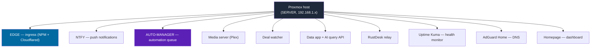

### A storage trap worth knowing in advance

On a ZFS-root Proxmox install, the root dataset can be configured so that **non-root users cannot write under `/var/`, `/etc/`, or anywhere on the system pool — even with wide-open permissions.** This shows up as a baffling "permission denied" that looks like a bug but isn't. The fix is a rule: pick one dedicated data path (for example, `/mnt/lab-data/`) on your bulk drive, and make *that* the place any non-root automation writes — logs, queues, clones, backups. Decide this on day one; retrofitting it later is annoying.

🟢 **Plain English.** Proxmox is software that turns one computer into many pretend computers, each kept separate from the others. The golden rule is: don't clutter the main system — give every app its own little sandbox. Keep a simple list of which sandbox is which (a phone-contacts-style directory for your apps). And pick one folder on your big drive as the "scratch and storage" area where all the automation is allowed to write files, to avoid a confusing permissions headache later.

---

## 4. Networking and remote access

There are three distinct ways traffic reaches your services, and choosing the right one per service *is* the security model. Mixing them up is the most common way homelabs get compromised.

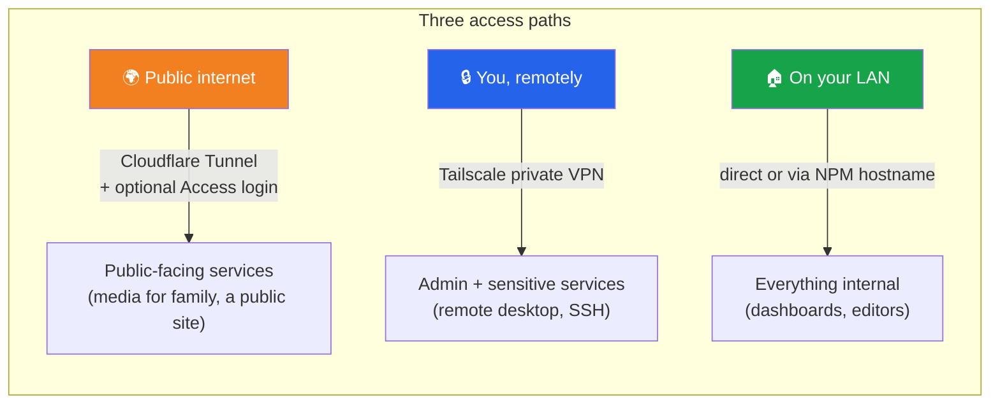

### Path 1 — Public, via Cloudflare Tunnel + Nginx Proxy Manager

For the handful of services that genuinely need to be reachable from the open internet, you use a **Cloudflare Tunnel**. A small agent (`cloudflared`) running in your EDGE container makes an *outbound* connection to Cloudflare, and Cloudflare forwards public traffic back down that tunnel. **You never open a port on your router.** That single fact eliminates a whole category of risk.

Behind the tunnel sits **Nginx Proxy Manager (NPM)**, also in EDGE, which turns ugly `IP:port` combinations into friendly hostnames like `app.lab.example.com` and routes each one to the right internal container.

A hard-won lesson worth stating loudly: when Cloudflare forwards to NPM's plain HTTP port, the tunnel's origin setting **must be `http://`, not `https://`.** Setting it to `https://` against an HTTP port produces a confusing Cloudflare 502 (a TLS handshake mismatch). Let Cloudflare handle the public HTTPS; NPM speaks plain HTTP internally; don't ask NPM for its own certificate on tunneled routes.

For sensitive-but-public routes, add **Cloudflare Access** in front — a login gate (email one-time-passcode, or your identity provider) that runs *before* traffic ever reaches your service.

### Path 2 — Private, via Tailscale

[Tailscale](https://tailscale.com/) is a mesh VPN that gives every enrolled device a stable private address (the `100.x.x.x` range) reachable from anywhere, with no ports opened. This is the right path for anything you alone need: SSH into the server, a self-hosted remote-desktop relay, admin panels. In the reference lab, the AI's SSH access and the RustDesk relay are **Tailscale-only** — invisible to the public internet entirely.

### Path 3 — Local, on the LAN

Internal-only tools (file browsers, the NPM admin page, the DNS admin, databases) get no public route at all. You reach them by LAN IP, by a dashboard link, or by a local hostname if you run local DNS. The rule: **admin interfaces, databases, and config editors stay private.** If you ever need them remotely, reach them over Tailscale — never by punching a hole in the firewall.

One more piece: a DNS filter like **AdGuard Home** running as its own container can serve as your network's DNS, blocking ads/trackers and (optionally) giving you friendly local hostnames.

🟢 **Plain English.** There are three doors into your lab. The **front door** (Cloudflare Tunnel) is for the few things the outside world is allowed to use, like a movie server you share with family — and it works without drilling a hole in your house, because the connection reaches *out* to Cloudflare rather than letting strangers reach *in*. The **private side door** (Tailscale) is a secret tunnel only your own devices know about, for admin stuff and remote control. And the **inside hallway** (your home network) is for everything you only touch while sitting at home. The golden rule: never put admin controls or databases on the front door.

---

## 5. Notifications: self-hosted ntfy

[ntfy](https://ntfy.sh/) is a dead-simple publish/subscribe notification service: a program POSTs a message to a "topic" (a URL path), and any device subscribed to that topic gets a push notification. You can use the public `ntfy.sh`, but self-hosting it in its own container gives you control and privacy — and it becomes the nervous system that lets every other part of the lab *tell you things*.

### How it fits together

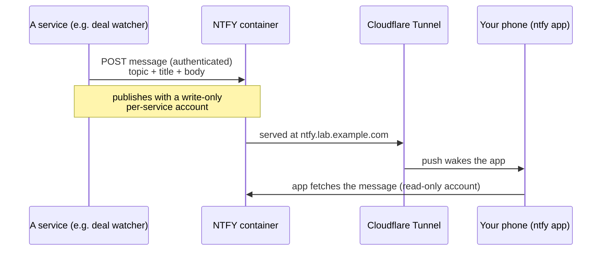

### The setup that actually works

A few things that took trial and error in the reference build, so you can skip the pain:

1. **Run it in its own container** and route it publicly through Cloudflare Tunnel + NPM, because you want notifications to arrive when you're *away* from home, not just on Wi-Fi.
2. **Origin scheme matters** (same lesson as §4): the tunnel origin to NPM is `http://`, not `https://`.
3. **iOS push needs the public HTTPS URL set exactly** in the phone app's "Default server" field, and ntfy uses the upstream `ntfy.sh` service purely as a *wake bridge* so Apple will wake the app — your messages still come from your own server. Test once on Wi-Fi and once on cellular.
4. **Lock it down with authentication.** Turn anonymous access to **deny-all**. Give each publishing service its **own write-only account**; give your phone a **read-only account**. Then:
   - **Topic names are treated as semi-secret** and kept out of Git and docs — they're not your security boundary (the auth is), but there's no reason to publish them.
   - **Notification text never contains secrets** — no API keys, no passwords, no private paths in a message body.

### The clever bit: an approval channel

Beyond ordinary alerts, ntfy doubles as an **approval mechanism** for risky automation. When the automation manager wants to do something dangerous (like update the broker itself), it posts a random one-time token to a dedicated `approvals` topic and then *waits up to two minutes for that exact token to be echoed back*. You approve by replying with the token from your phone. No reply, no action. This turns your phone into a physical "yes/no" button for the most dangerous operations — covered fully in the next section.

🟢 **Plain English.** ntfy is a way for your server to text your phone. You run your own copy of it so the messages stay private. Every app that wants to ping you gets its own "sender" login that can only send (never read), and your phone gets a "receiver" login that can only read. You also use it as a panic button in reverse: when the AI wants to do something risky, it sends you a one-time code and freezes; nothing happens unless you text the code back within two minutes.

---

## 6. The automation brain

This is the heart of the system and the part worth getting right. The goal: let an AI help you *operate* the server — deploy a service, run a pipeline, restart something, check logs — **without ever giving it a shell or root.**

### The three-way collaboration

No single AI does everything. Three roles, each assumed to be fallible, check each other:

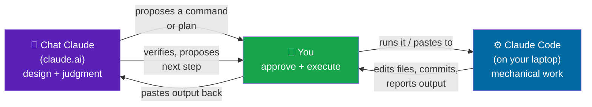

- **Chat Claude** is the design-and-judgment layer. It produces commands, reads output critically, decides what to commit and when to push back. It has no access to your machine.
- **You** are the only one who actually runs anything on the server. You approve, you execute, you paste results back.
- **Claude Code** runs on your laptop with local file access. It edits code, runs local scripts, commits to Git. It **cannot** SSH to the server or deploy — it proposes; you dispose.

The discipline that makes this work, distilled from real incidents:

1. **Verify before claiming.** AI agents will confidently say "committed" / "deployed" / "fixed" when it isn't true. Never accept a claim without evidence — make it show the actual commit hash, the actual diff, the actual command output.
2. **Gate before commit.** Require a diff or a test run *before* anything is committed, so unvalidated code doesn't land in history.
3. **One step at a time.** Insist on step-by-step execution with verification at each step. A six-step plan run all at once hides which step failed.
4. **Don't trust pattern-matching.** An agent will propose methods from its training data that don't fit your setup. Check proposals against your documented procedures; if they contradict, the agent is guessing.
5. **Read output critically, not eagerly.** The one line that matters is often buried in fifty lines of progress messages. Scan for evidence, not for the cheerful "All done!" at the bottom.

🟢 **Plain English (the three-way model).** Imagine renovating a house with a brilliant architect who works remotely (Chat Claude), a skilled handyman in your garage (Claude Code), and you in the middle. The architect draws up exactly what to do but never touches the house. The handyman builds things in the garage and hands them to you, but isn't allowed inside the house. *You* are the only one who carries anything into the house and installs it. Crucially, you've learned that both the architect and the handyman sometimes say "done!" when they're not — so you always check the actual work before believing them.

### The broker: how the AI safely touches the server

The automation manager (its own container) can reach the Proxmox host *only* through a **broker** — a script installed as a "forced command" on a restricted SSH user. When that user logs in, they don't get a shell; they get the broker, which:

- is **deny-by-default**: it runs a fixed list of named actions and refuses everything else;
- **logs every invocation**;
- has its source under version control, so changes are reviewable;
- and for the most dangerous action (updating the broker itself), requires the **ntfy approval token** described in §5.

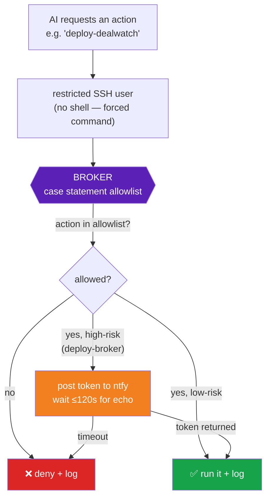

The allowlist holds *specific* verbs — `validate-<service>`, `deploy-<service>`, `restart-service <name>` (and even that takes only a fixed set of service names), `read-log <name>`, `backup-status`, container-inspection commands, and so on. Anything not on the list is denied. The restricted user also has a narrow `sudo` allowlist (read-only and management commands like `pct`, `qm`, `systemctl status`) — not blanket root.

The line that matters: **the AI can *request named actions*, but it can never open a general-purpose shell.** That's the difference between "AI with a remote control that has labelled buttons" and "AI with the keys to everything."

🟢 **Plain English (the broker).** The broker is a vending machine, not a kitchen. The AI can press labelled buttons — "deploy the deal watcher," "restart the media server," "show me the backup status" — and the machine dispenses exactly that, while writing down everything it dispensed. The AI cannot wander into the kitchen and cook whatever it wants. And for the one button that could break the vending machine itself, the machine first texts you a code and waits — it only proceeds if you text the code back.

### Two ways the AI drives the broker

- **Live sessions:** you, working with Claude Code over Tailscale SSH, invoke broker actions interactively. Good for hands-on work where you're present.
- **A Git-backed queue:** approved task files land in a `queue/approved/` folder in the automation repo; a timer on the manager container picks them up and runs them through the broker. Good for asynchronous, "do this when ready" work. (The reference lab keeps a `validate-hello-manager` proof-of-concept action as the canonical "is the whole chain alive?" test.)

---

## 7. GitHub and "Git-as-transport"

Two Git repositories sit at the center of the lab:

| Repo | Holds | Tracked / not tracked |
|---|---|---|
| `automation-repo` | App code, deploy scripts, broker source, container configs, the task queue, deployment specs | everything code-and-config; runtime databases are `.gitignore`d |
| `vault-repo` | The Obsidian documentation vault (see §8) | curated "why" notes tracked; auto-generated live-state notes ignored |

A sane layout for the automation repo:

```text
automation-repo/
├── apps/                 # application source, one folder per service
│   ├── deal-watcher/
│   └── data-app/
├── deployments/          # per-service deploy.sh + spec.md
├── broker/               # broker source + the allowlist (reviewable)
├── scripts/              # helper scripts (deploy, backup, validate)
├── configs/              # container + service config templates
├── state/                # machine-readable inventory (lxc.json, vms.json)
└── queue/approved/       # task files the manager runs through the broker
```

### Why "Git-as-transport"

You'd think moving a file from your laptop into a container would be easy — just SCP it. In practice, the broker (which intercepts SSH) breaks SCP and SFTP with banner output, the restricted user has no password login, and a quick HTTP file server runs into the laptop's firewall. Rather than fight all three, the reference lab adopted **Git as the transport layer**:

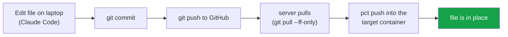

The file rides through GitHub and lands on the host, which then pushes it the last hop into the container. It feels indirect, but it's reliable, it leaves an audit trail (every change is a commit), and it gives you free rollback. The lesson generalizes: **when the "obvious" transport keeps failing, a slightly indirect path that you fully understand beats a direct path that flakes.**

### Connecting AI tools to GitHub

Claude Code commits and pushes directly using your Git credentials on the laptop. For *small* documentation edits, a GitHub connector/MCP can let an assistant read and commit tracked Markdown straight to the repo. Keep the division clear: small, low-risk doc tweaks can go direct; anything that needs local validation or touches multiple files should go through the laptop → review → commit path.

🟢 **Plain English.** Everything important is stored in two online folders (Git repositories) that remember every change you ever make — so you can always undo. Moving a file onto the server *should* be simple, but the security guard (the broker) kept blocking the simple methods. So instead, you upload the file to the shared online folder, and the server downloads it from there. A bit roundabout, but it always works and keeps a perfect history of every change.

---

## 8. Documentation: a Git-backed Obsidian vault

[Obsidian](https://obsidian.md/) is a note-taking app that stores plain Markdown files in a folder. Point it at a folder that's also a Git repo, and your documentation gets version history, rollback, and the ability for automation to update it.

### The crucial split: generated vs. curated

The insight that keeps the docs from rotting:

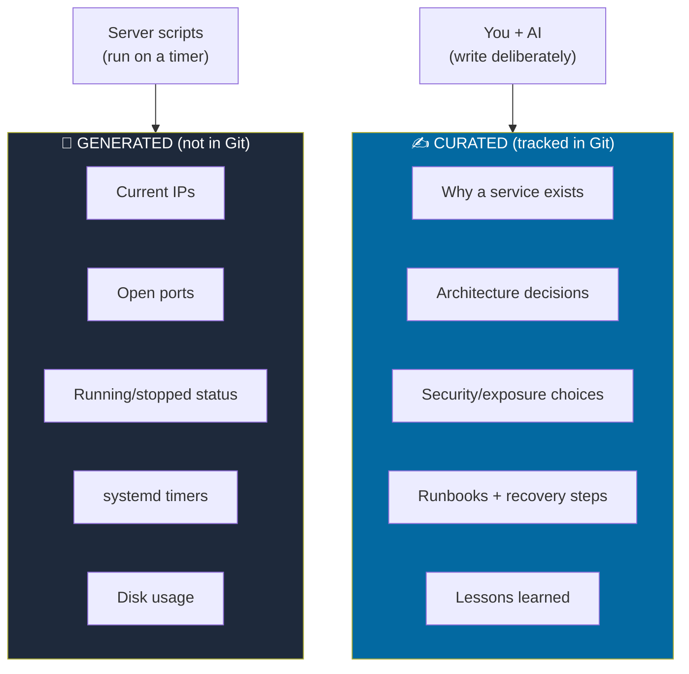

- **Generated notes** capture fast-changing live facts. Scripts on the server regenerate them on a schedule; they're *not* tracked in Git because they change constantly and would create noise. Never hand-write an IP address or port into a durable note — point at the generated page instead.
- **Curated notes** capture durable truth: why something exists, how it relates to other things, what the risks are, how to recover it. These *are* tracked in Git, and they're what humans and AI deliberately write.

A clear **source-of-truth precedence** resolves conflicts: (1) live command output wins, then (2) generated current-state notes, then (3) curated notes, then (4) old chat history is context only.

### The update workflow

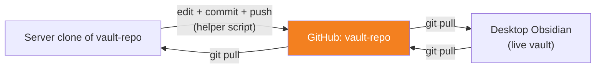

Both the desktop (where you read and write notes in Obsidian) and the server (where automation writes notes) are clones of the same repo. After any change, both pull to stay in sync. Helper scripts on the server wrap the commit/push so a session can be closed out with one command and a confirmation prompt. A simple "definition of done" keeps it honest: a change isn't finished until the relevant curated note is updated, the change log has an entry, follow-ups are captured, and GitHub/server/desktop are all back in sync.

🟢 **Plain English.** Your documentation lives as simple text files that also get backed up online with a full history. The trick that keeps it from going stale: the computer automatically writes down all the facts that change a lot (addresses, what's running) so you never have to, while you and the AI only hand-write the things that *don't* change much — why each thing exists and how to fix it if it breaks. When two notes disagree, you trust whatever the live machine reports right now over anything written down earlier.

---

## 9. Four worked examples

These four real services show the range of what the system handles — from a simple media server to an AI-powered data pipeline. Each follows the same deployment pattern: code in `automation-repo`, a `deploy.sh` + `spec.md` per service, the broker doing the actual deploy, secrets injected from root-only files, and an ntfy notification on completion.

### Example A — A media server (the simple case)

The most ordinary service in the lab: a Plex media server in its own LXC, serving the household. There's nothing AI about it — it's the baseline that shows the container model.

What makes it instructive is the **two-tier backup** it requires, a pattern that applies to any stateful app:

- the container's root filesystem (a normal Proxmox backup), **and**
- the app's own data directory (metadata, preferences, posters) backed up separately, because it's large and lives on a host-side path.

A naming discipline also pays off here: the lab runs *two* media servers (one on this box, one on the NAS) with deliberately different names so they're never confused. Lesson: when you'll have two of something, name them distinctly from the start.

🟢 **Plain English.** This is just a Netflix-for-your-own-movies box, living in its own sandbox. The only clever part is that backing it up takes two pieces: a snapshot of the sandbox itself, *and* a separate copy of all its settings and artwork, because that part is big and stored elsewhere.

### Example B — A self-hosted remote-desktop relay (the private case)

A [RustDesk](https://rustdesk.com/) server lets you remote-control your computers without using a third-party cloud. It runs as two small Docker containers (an ID/rendezvous server and a relay) inside one LXC. The defining decision: it's **Tailscale-only** — no router ports, no Cloudflare route. Your remote-desktop clients reach it over the private VPN.

This example also illustrates a **secret-handling discipline** the whole lab follows. RustDesk generates a key pair; the public key is needed to configure clients. It would be tempting to paste that key into your docs — and in fact, early on it *was* documented in the vault, which meant it had effectively been published. The fix became a permanent rule:

> **Never store key values in docs, Git, screenshots, or chat. Store only a pointer:** "the key is in `/opt/rustdesk-server/data/id_ed25519.pub` on the relay container." If a secret ever does leak into tracked files, rotate it (regenerate the key, update clients) and treat the old one as burned.

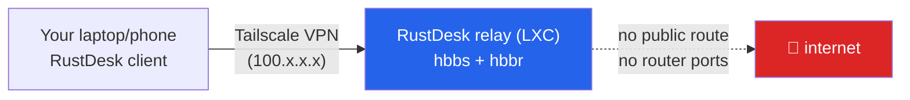

🟢 **Plain English.** This lets you control your home computers from anywhere, like TeamViewer but entirely your own — and it's only reachable through your private VPN, so the public internet can't even see it exists. The big lesson it taught: never write down a password or key in your notes, even private ones, because your notes get backed up online. Write down *where* the key lives, not the key itself.

### Example C — An AI-powered deal watcher (automation + the Claude API)

A service that watches secondhand-hardware listings (a subreddit's feed and an auction-site API) and alerts you when something worth buying appears. It comes in two flavors that together show the spectrum of "smart":

- a **rules-based** watcher that scores listings on keywords, price, and category, and
- an **AI-powered** GPU watcher that sends each candidate listing to a fast Claude model (Haiku) and asks it to evaluate the part against a baseline you care about — for the reference lab, "is this a meaningful upgrade for running local AI models?", weighted by memory bandwidth, then VRAM, then compute, then price. The model returns structured JSON (a verdict, confidence, reasoning, pros/cons), the service logs every evaluation to a small database for de-duplication, and **only an `upgrade` verdict fires a notification.**

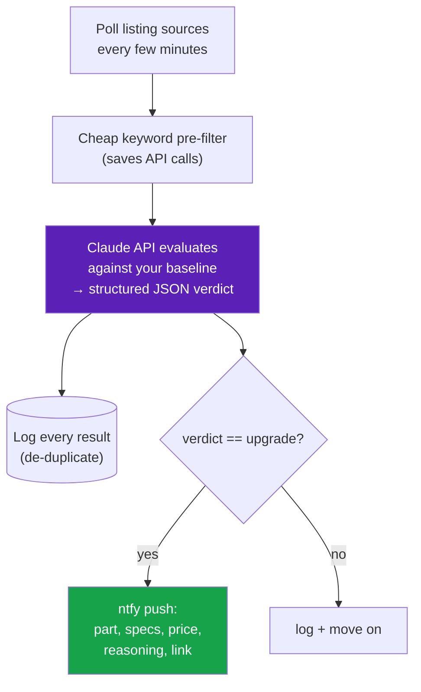

Two design notes generalize well. First, the **cheap pre-filter before the expensive AI call** — don't pay for a model evaluation on a listing a keyword check can reject for free. Second, the API key lives in a root-only secrets file (`/etc/.../anthropic.key`) and is injected into the service's config at deploy time, never committed.

🟢 **Plain English.** This is a robot bargain-hunter. It constantly scans listings, and for the tricky category (graphics cards) it actually asks an AI "is this a good deal for what I want to do?" and only buzzes your phone when the answer is a clear yes. To keep the AI costs low, it does a quick free check first and only consults the AI on listings that pass. The AI's password is kept in a locked drawer on the server, never written into the shared files.

### Example D — A data app with an AI query interface (the full pipeline)

The most elaborate example: a project that digitizes decades of historical scoring documents into a searchable database with a natural-language question interface. It spans several containers and shows nearly every technique in this guide working together:

- a **pipeline container** that imports spreadsheet data, downloads source PDFs, runs **OCR** on scanned pages, and uses **Claude's vision capability** to extract data from images — run on a schedule and on demand, only when new data or corrections arrive;
- a **database + browser** ([DuckDB](https://duckdb.org/) for analysis, [Datasette](https://datasette.io/) for a web UI);
- an internal **AI query API** (FastAPI) that turns plain-English questions into answers over the data using the Claude API; and
- a **public** front-end and a separate public query API, exposed through Cloudflare — deliberately split from the internal versions (the shared database is mounted read-only to the public clone) so the public surface can never reach internal data.

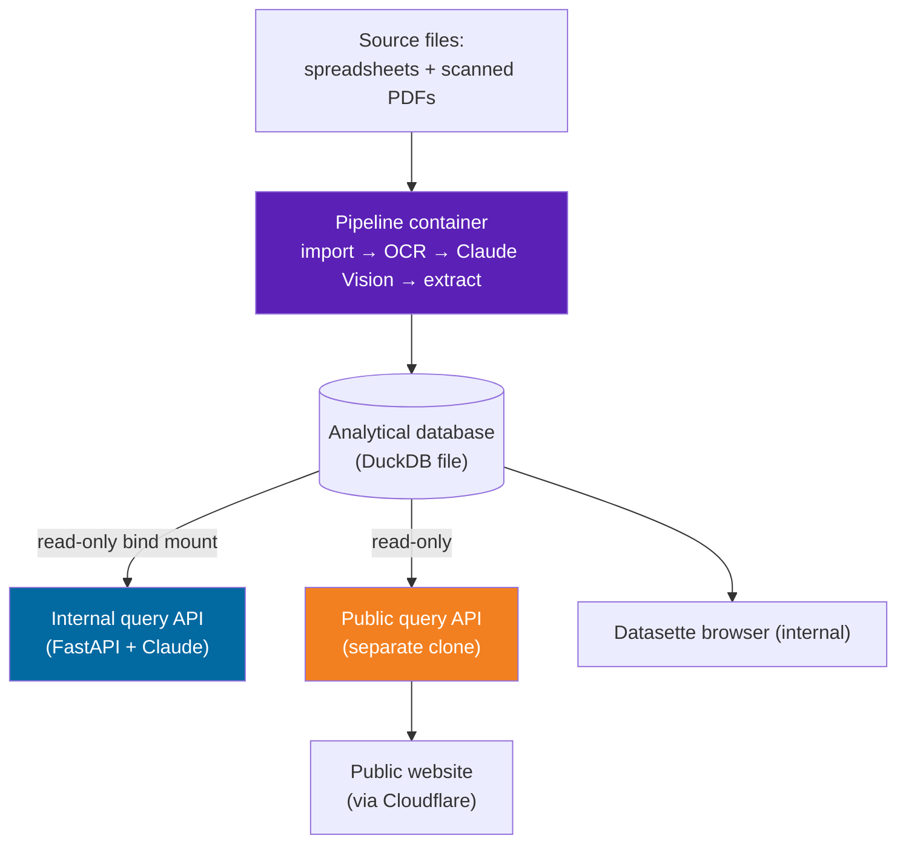

The standout architectural decision is the **strict internal/public split**: the public query API is a *separate* container from the internal one, the database is shared to it **read-only**, and the two never mingle. When you expose anything publicly, build the public path as its own thing with the narrowest possible access to your data — don't bolt a public door onto an internal service.

🟢 **Plain English.** This one turns a giant pile of old scanned paperwork into something you can just ask questions about in plain English. A nightly robot reads the documents — even using AI to "look at" scanned images — and files everything into a database. Then an AI answers your questions from that database. The smart safety move: the public version that strangers can use is a completely separate copy that can only *read* the data, kept walled off from the private internal version, so a visitor can never reach anything they shouldn't.

---

## 10. The security model in one place

Everything above shares one philosophy: **minimize trust, log everything, keep secrets out of anything that syncs.** Collected here as a checklist you can hand to someone:

| Principle | In practice |
|---|---|
| **No inbound ports** | Public access via Cloudflare Tunnel (outbound only); private access via Tailscale. The router stays closed. |
| **AI never gets a shell** | All AI-initiated server actions go through the deny-by-default broker. The restricted SSH user runs a forced command, not a login shell. |
| **Narrow `sudo`** | The automation user has `NOPASSWD` only for a short list of read-only/management commands, not blanket root. |
| **Human-in-the-loop for danger** | The riskiest actions require an ntfy one-time-token approval from your phone. |
| **Secrets live in root-only files** | API keys, passwords, private keys sit in `/etc/.../*.key` style files (mode 600) and are injected at deploy time. |
| **Docs point at secrets, never contain them** | "The key is at `<path>`," never the key value. If a secret lands in Git/docs, rotate it. |
| **Topic names are semi-secret** | Notification topics aren't your security boundary (auth is), but keep them out of Git anyway. |
| **Public = separate + read-only** | Public-facing services are their own containers with the narrowest access to data; never expose an internal service directly. |
| **Everything is logged** | The broker logs every action; Git logs every code and doc change. |

🟢 **Plain English.** The whole approach assumes things *will* go wrong, so it limits how much damage anything can do. Strangers can't knock on your door directly. The AI can only press approved buttons, never grab the keys. The really dangerous buttons need you to confirm from your phone. Passwords are kept in locked drawers, and your notes only say *which drawer* — never the password itself. And everything that happens gets written in a logbook.

---

## 11. Backups and recovery

A homelab without tested restores is a hobby, not infrastructure. The reference lab uses layered backups:


- **Local backups** (Proxmox VM/LXC snapshots + host config + per-app data) live on the bulk drive — fast to restore, but useless if the whole box dies.
- **An off-machine mirror** to a NAS protects against the box dying.
- **An archive tier** that never auto-deletes protects against "I deleted the wrong thing and the mistake replicated everywhere."

Two habits matter more than the tooling. First, **exclude the giant disks** (camera recordings, scratch/staging volumes) from routine backups so a 3 TB recording disk doesn't bloat every snapshot. Second — and this is the one everyone skips — **actually test a restore.** A backup you've never restored from is a guess. Write a short "if everything dies, here's the order I bring things back" runbook (ingress first, then the services that depend on it), and verify the restore commands work *before* you need them.

🟢 **Plain English.** Keep three copies of everything that matters: one on the server (quick to grab), one on a separate storage box (in case the server dies), and one in a "never automatically delete" archive (in case you delete something by accident and the mistake spreads). Skip backing up the truly huge stuff like video recordings. And the part almost everyone forgets: at least once, actually *try* restoring from a backup, so you know it works before disaster strikes.

---

## 12. Appendix

### Build order (a suggested path)

If you're starting fresh, this order minimizes pain — each step builds on the last:

1. Install Proxmox; pick your dedicated writable data path.
2. Stand up EDGE (NPM + Cloudflared) and get one test service reachable.
3. Add Tailscale for private access.
4. Deploy self-hosted ntfy; get a test push to your phone on and off Wi-Fi.
5. Create the two Git repos (`automation-repo`, `vault-repo`).
6. Set up the Obsidian vault (generated vs. curated split).
7. Build the restricted SSH user + broker (start with one read-only action).
8. Add the ntfy approval gate for the broker self-update.
9. Wire up Claude Code on your laptop; practice the three-way workflow on a trivial change.
10. Deploy your first real service end-to-end through the broker.
11. Set up layered backups and *test a restore.*

### Glossary

| Term | Meaning |
|---|---|
| **Proxmox VE** | Free OS that runs virtual machines and containers |
| **LXC** | Lightweight Linux container (most services live in these) |
| **VM** | Full virtual machine (for special hardware needs or non-Linux) |
| **EDGE** | The container holding your reverse proxy + tunnel agent |
| **NPM** | Nginx Proxy Manager — maps friendly hostnames to internal services |
| **Cloudflare Tunnel** | Outbound connection that exposes services publicly without open ports |
| **Cloudflare Access** | A login gate in front of a public route |
| **Tailscale** | Mesh VPN giving your devices private `100.x.x.x` addresses |
| **ntfy** | Self-hosted push-notification service |
| **Broker** | Deny-by-default script that is the *only* thing AI/SSH can run on the host |
| **Forced command** | An SSH setting that runs one fixed program instead of a login shell |
| **Git-as-transport** | Moving files via commit → push → pull → `pct push` |
| **Generated vs. curated** | Auto-written live facts (not in Git) vs. deliberate "why" notes (in Git) |
| **Claude Code** | Anthropic's coding agent that runs locally on your laptop |
| **MCP** | Model Context Protocol — how assistants connect to tools/services like GitHub |

### A note on what's *yours* to decide

This guide describes one coherent way to do it, but the design has dials. You might skip Tailscale if everything is LAN-only; you might use a different notification system; you might not want AI in the loop at all and just keep the broker as a clean automation layer. The parts worth keeping no matter what: **isolation per service, no open inbound ports, secrets out of anything that syncs, and tested restores.** The AI control plane is the interesting frosting; those four are the cake.

---

*Built and documented as a personal homelab project. All hostnames, addresses, and identifiers in this guide are illustrative placeholders — substitute your own. No secrets, keys, or credentials are included by design; if you adapt this, keep it that way.*
